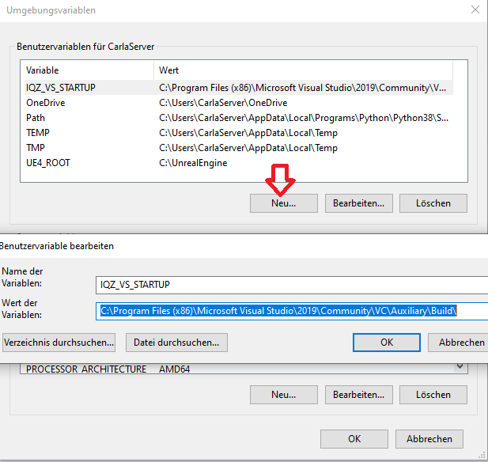

Dateipafd der x64 Prompt öffnen

Eigenschaften der x64 Prompt öffnen

Ziel inhalt kopieren
Sollte ähnlich aussehen wie 
%comspec% /k "C:\Program Files (x86)\Microsoft Visual Studio\2019\Community\VC\Auxiliary\Build\vcvars64.bat"

Umgebungsvariablen öffnen

Neue Variable hinzufügen mit dem Namen IQZ_VS_STARTUP

und hier wird der Wert C:\Program Files (x86)\Microsoft Visual Studio\2019\Community\VC\Auxiliary\Build
aus dem vorherigen Zielinhalt

alle Fenster mit ok bestätigen und so schliesen.
