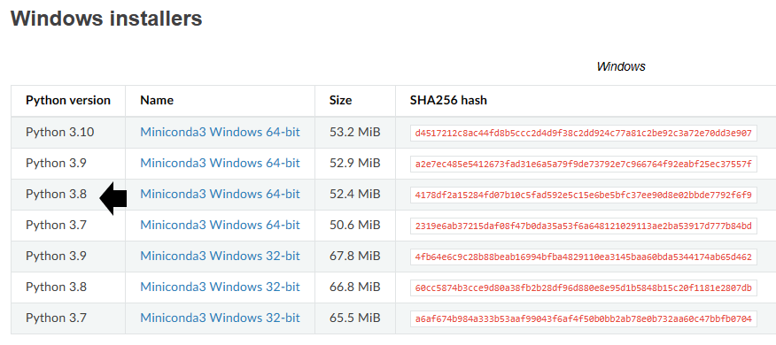
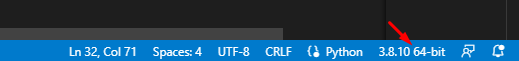
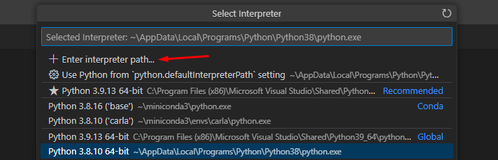

Download miniconda from https://docs.conda.io/en/latest/miniconda.html

it is suggested that you download the Python 3.8 Version

Install conda with the Installer. 

You dont need to select some specific things, regular setup is enough

BUT REMEMBER THE FOLDER YOU ARE INSTALLING IT IN.

After Conda is installed we need to create our environment

Start the Anaconda Prompt

Now you move to the .\carla\Documentation Folder

now you need to execute

>conda env create -f carla.yml

now your conda enviroment got create

to use it -> Start Anaconda promt and enter
>conda activate carla

To import the environment into Visual Studio Code

Click on your current interpreter in Visual Studio Code

Click on "Enter a interpreter path" and then on "Find" 

Head to the folder where you have miniconda installed.

Select the Folder envs

Select the Folder of the Environment you want to use

Select the Python.exe

It Should look like this now

