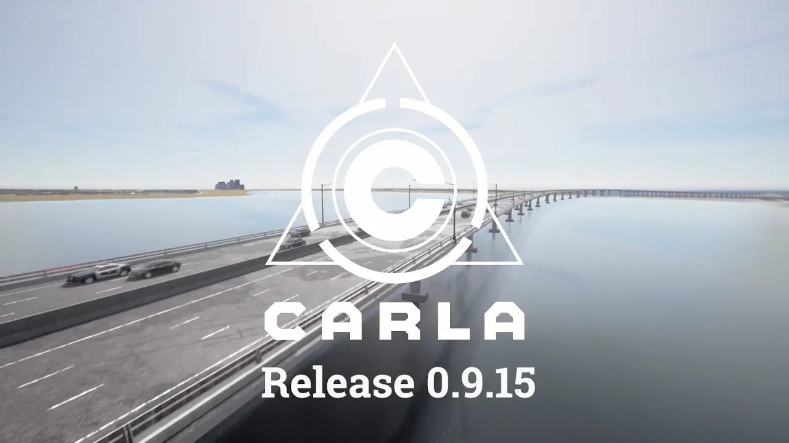

# Carla Faulty Sensor Extension
This repository extends the CARLA driving simulator by a fault versions of the natively implemented sensors.
In the real world, several factors influence the normal operation of sensors and thus an ideal output may be easily simulated, yet not realistic.
The goal of this work is to create a modified version of the existing radar, lidar and camera sensor, that is capable of producing falsified data, matching various real-world effects and influences.
In the end, these sensors can be used to create a more realistic perception output, or to train and validate other applications with incorrect sensor outputs.

## General
The Radar, the Lidar as well as the RGB Camera got extended by the following models:
```c++
	enum ScenarioID : int
	{
      PackageLoss = 0x1,              // 1
      PackageDelay = 0x2,             // 2
      CoordinateDataShift = 0x4,      // 4
      AdditonalDataShift = 0x8,       // 8
      RangeReduction = 0x10,          // 16
      DetectNonExistingPoints = 0x20, // 32
      SensorShift = 0x40,             // 64
      SensorBlockage = 0x80,          // 128
      ShaderError = 0x100             // 256
	};
```
Which model is supported by which sensor is shown in the following Table:

| Failure model            | Radar | LIDAR | Camera |
|--------------------------|:-----:|:-----:|:------:|
| Package Loss             | ✅    | ✅    | ✅     |
| Package Delay            | ✅    | ✅    | ❌     |
| CoordinateDataShift      | ✅    | ✅    | ❌     |
| AdditonalDataShift       | ✅    | ✅    | ❌     |
| RangeReduction           | ✅    | ✅    | ❌     |
| DetectNonExistingPoints  | ✅    | ✅    | ❌     |
| SensorShift              | ✅    | ✅    | ❌     |
| SensorBlockage           | ✅    | ✅    | ❌     |
| ShaderError              | ❌    | ❌    | ✅     |

To spawn a sensor (via PythonAPI) you can use the subsequent Blueprint identifiers:

```python
sensor.other.faulty_radar
sensor.other.faulty_lidar
sensor.camera.faulty_rgb
```
---
# Failure Model Types and Parameters

For each model, there are different types of parameters that can be set. Each model represents a specified failure:

- **PackageLoss** 
  - Failures where the connection between a sensor and following systems breaks during the simulation e.g. a loose connection
- **PackageDelay**
  - Failures where the connection between a sensor and following systems is corrupted and data is delayed e.g. an overload within the data transfer
- **ShiftSensor**
  - Failures where the sensor changes its FOV during the simulation e.g. the sensor is not properly connected to the vehicle frame
- **Coordinate_PointDataShift**
  - Failures where the coordinates of the detection points get changed e.g. due to vibrations effecting the radar/lidar sensor
- **AdditionalData_PointDataShift**
  - Failures where additionally collected data (radar - velocity & lidar - intensity) gets changed e.g. vibrations within a radar/lidar-sensor
- **RangeReduction**
  - Failures where the effective range of the sensor is reduced e.g. rain in case of lidar sensors
- **Blockage_AreaEffects**
  - Failures where the beams of the sensor are completely blocked e.g. dirt sticking on the radar or lidar lense
- **RandomPoints_AreaEffects**
  - Failures where additional points get detected e.g. due spoofing or jamming attacks on the radar/lidar
- **ShaderError**
  - Failures on the camera affecting the camera image (currently only used to simulate a packageloss where a picture is sent, but shows a completely black image)

Additionally, each model has its own set of parameters that can be accessed by combining the failure type with the parameter name.

---

## Common Parameters for all Failures
While some parameters are specific to the failure type, several parameters are used throughout all:

- **_Start**  
  First occurrence of the failure in the simulation in seconds (float, seconds)
- **_Duration**  
  Time duration of the failure occurrence in seconds (float, seconds)
- **_DurationDegradation**  
  Degradation of the duration time (failure time) in seconds (float, seconds)
- **_Interval**  
  The time duration between the two failure occurrences (float, seconds)
- **_IntervalDegradation**  
  Degradation of the occurrence interval (time between failures) in seconds (float, seconds)
- **_seed**  
  The seed used for everything that relies on a uniform distribution (integer, number)

Note that in Python all of these inputs are handled as strings.

---

## Model-Specific Parameters

### PackageDelay

- **_DelaySize**  
  The number of packages delayed in the specific failure occurrence (integer, number)
- **_DegradationSize**  
  Degradation of the delay by the increase of the number of delayed packages per failure occurrence (integer, number)
- **_RingBufferMaxUseSize**  
  The maximum size until a package is dropped due to a simulated overflow (cannot be larger than 128) (integer, number)

---

### ShiftSensor

- **_Yaw**  
  Yaw angle of the sensor shift (float, angle)
- **_Roll**  
  Roll angle of the sensor shift (float, angle)
- **_Pitch**  
  Pitch angle of the sensor shift (float, angle)
- **_ConstantShiftFlag**  
  If `true`, the sensor is shifted in every frame of the duration; if `false`, the sensor is shifted only once at the start of the failure occurrence (boolean, flag)

---

### Coordinate\_PointDataShift and AdditionalData\_PointDataShift

- **_MaxShift**  
  The number of points that will be shifted (integer, number)
- **_PossibilityToShiftPoint**  
  The probability that a point gets shifted (float, percentage)

---

### RangeReduction

- **_Range**  
  Reduction of the sensor's covered distance/range in meters (float, meter)

---

### Blockage\_AreaEffects and RandomPoints\_AreaEffects

- **_CloseRange**  
  If `true`, points will only spawn within 1 meter of the sensors; if `false`, points will spawn throughout the sensor's entire range (boolean, flag)
- **_HorizontalFlag** and **_VerticalFlag**  
  These flags determine which part of the sensor's field of view is used to spawn a blockage or a random point (int, enum). Their values are defined by the following enums:

#### Horizontal Flags

```c++
enum HorizontalFOV_Type : int
{
    Left = 0,
    WholeHorFOV = 1,
    Right = 2
};
```
#### Vertical Flags
```c++
enum VerticalFOV_Type : int
{
    Down = 0,
    WholeVerFOV = 1,
    Up = 2
};
```
- **_Ammount**  
  The number of spawned points (integer, number)

### Additional Parameters for Blockage_AreaEffects

- **_MaxLifeTime**  
  The maximum lifetime per spawned blockage object (float, time)
- **_RandomObjectLifeTime**  
  If `true`, a random time between 0 and \_MaxLifeTime is chosen for the lifetime of a blockage object; if `false` \_LifeTime is used (boolean, flag)
- **_LifeTime**  
  Number of seconds an object will last during the simulation (if negative, the object will last forever) (float, seconds)
- **_DropSpeed**  
  The speed at which an object moves along the z-axis each frame (float, meters)

# Example

A sample setup code for a faulty radar with a blockage can be seen here:

```python
bp = world.get_blueprint_library().find('sensor.other.faulty_radar')
bp.set_attribute('horizontal_fov', str(90))
bp.set_attribute('vertical_fov', str(30))
bp.set_attribute('range', str(100))

bp.set_attribute('scenario', str(128))
bp.set_attribute('Blockage_AreaEffects_Start', str(5))
bp.set_attribute('Blockage_AreaEffects_Interval', str(3))
bp.set_attribute('Blockage_AreaEffects_Duration', str(0))
bp.set_attribute('Blockage_AreaEffects_CloseRange', "True")
bp.set_attribute('Blockage_AreaEffects_Ammount', str(20))
bp.set_attribute('Blockage_AreaEffects_HorizontalFlag', str(1))
bp.set_attribute('Blockage_AreaEffects_VerticalFlag', str(1))
bp.set_attribute('Blockage_AreaEffects_RandomObjectLifeTime', "False")
bp.set_attribute('Blockage_AreaEffects_MaxLifeTime', str(0))
bp.set_attribute('Blockage_AreaEffects_DropSpeed', str(0))
bp.set_attribute('Blockage_AreaEffects_LifeTime', str(0))
```

CARLA Simulator
===============

[](http://carla.readthedocs.io)

[](http://carla.org)
[](https://github.com/carla-simulator/carla/blob/master/Docs/download.md)
[](http://carla.readthedocs.io)
[](https://github.com/carla-simulator/carla/discussions)
[](https://discord.gg/8kqACuC)

CARLA is an open-source simulator for autonomous driving research. CARLA has been developed from the ground up to support development, training, and
validation of autonomous driving systems. In addition to open-source code and protocols, CARLA provides open digital assets (urban layouts, buildings,
vehicles) that were created for this purpose and can be used freely. The simulation platform supports flexible specification of sensor suites and
environmental conditions.

[](https://www.youtube.com/watch?v=q4V9GYjA1pE )

### Download CARLA

Linux:
* [**Get CARLA overnight build**](https://carla-releases.s3.us-east-005.backblazeb2.com/Linux/Dev/CARLA_Latest.tar.gz)
* [**Get AdditionalMaps overnight build**](https://carla-releases.s3.us-east-005.backblazeb2.com/Linux/Dev/AdditionalMaps_Latest.tar.gz)

Windows:
* [**Get CARLA overnight build**](https://carla-releases.s3.us-east-005.backblazeb2.com/Windows/Dev/CARLA_Latest.zip)
* [**Get AdditionalMaps overnight build**](https://carla-releases.s3.us-east-005.backblazeb2.com/Windows/Dev/AdditionalMaps_Latest.zip)

### Recommended system

* Intel i7 gen 9th - 11th / Intel i9 gen 9th - 11th / AMD ryzen 7 / AMD ryzen 9
* +32 GB RAM memory
* NVIDIA RTX 3070 / NVIDIA RTX 3080 / NVIDIA RTX 4090
* Ubuntu 20.04

## Documentation

The [CARLA documentation](https://carla.readthedocs.io/en/latest/) is hosted on ReadTheDocs. Please see the following key links:

- [Building on Linux](https://carla.readthedocs.io/en/latest/build_linux/)
- [Building on Windows](https://carla.readthedocs.io/en/latest/build_windows/)
- [First steps](https://carla.readthedocs.io/en/latest/tuto_first_steps/)
- [CARLA asset catalogue](https://carla.readthedocs.io/en/latest/catalogue/)
- [Python API reference](https://carla.readthedocs.io/en/latest/python_api/)
- [Blueprint library](https://carla.readthedocs.io/en/latest/bp_library/)

## CARLA Ecosystem
Repositories associated with the CARLA simulation platform:

* [**CARLA Autonomous Driving leaderboard**](https://leaderboard.carla.org/): Automatic platform to validate Autonomous Driving stacks
* [**Scenario_Runner**](https://github.com/carla-simulator/scenario_runner): Engine to execute traffic scenarios in CARLA 0.9.X
* [**ROS-bridge**](https://github.com/carla-simulator/ros-bridge): Interface to connect CARLA 0.9.X to ROS
* [**Driving-benchmarks**](https://github.com/carla-simulator/driving-benchmarks): Benchmark tools for Autonomous Driving tasks
* [**Conditional Imitation-Learning**](https://github.com/felipecode/coiltraine): Training and testing Conditional Imitation Learning models in CARLA
* [**AutoWare AV stack**](https://github.com/carla-simulator/carla-autoware): Bridge to connect AutoWare AV stack to CARLA
* [**Reinforcement-Learning**](https://github.com/carla-simulator/reinforcement-learning): Code for running Conditional Reinforcement Learning models in CARLA
* [**RoadRunner**](https://www.mathworks.com/products/roadrunner.html): MATLAB GUI based application to create road networks in the ASAM OpenDRIVE format
* [**Map Editor**](https://github.com/carla-simulator/carla-map-editor): Standalone GUI application to enhance RoadRunner maps with traffic lights and traffic signs information


**Like what you see? Star us on GitHub to support the project!**

Paper
-----

If you use CARLA, please cite our CoRL’17 paper.

_CARLA: An Open Urban Driving Simulator_<br>Alexey Dosovitskiy, German Ros,
Felipe Codevilla, Antonio Lopez, Vladlen Koltun; PMLR 78:1-16
[[PDF](http://proceedings.mlr.press/v78/dosovitskiy17a/dosovitskiy17a.pdf)]
[[talk](https://www.youtube.com/watch?v=xfyK03MEZ9Q&feature=youtu.be&t=2h44m30s)]


```
@inproceedings{Dosovitskiy17,
  title = {{CARLA}: {An} Open Urban Driving Simulator},
  author = {Alexey Dosovitskiy and German Ros and Felipe Codevilla and Antonio Lopez and Vladlen Koltun},
  booktitle = {Proceedings of the 1st Annual Conference on Robot Learning},
  pages = {1--16},
  year = {2017}
}
```

Building CARLA
--------------

Clone this repository locally from GitHub:

```sh
git clone https://github.com/carla-simulator/carla.git .
```

Also, clone the [CARLA fork of the Unreal Engine](https://github.com/CarlaUnreal/UnrealEngine) into an appropriate location:

```sh
git clone --depth 1 -b carla https://github.com/CarlaUnreal/UnrealEngine.git .
```

Once you have cloned the repositories, follow the instructions for [building in Linux][buildlinuxlink] or [building in Windows][buildwindowslink].

[buildlinuxlink]: https://carla.readthedocs.io/en/latest/build_linux/
[buildwindowslink]: https://carla.readthedocs.io/en/latest/build_windows/

Contributing
------------

Please take a look at our [Contribution guidelines][contriblink].

[contriblink]: https://carla.readthedocs.io/en/latest/cont_contribution_guidelines/

F.A.Q.
------

If you run into problems, check our
[FAQ](https://carla.readthedocs.io/en/latest/build_faq/).

Licenses
-------

#### CARLA licenses

CARLA specific code is distributed under MIT License.

CARLA specific assets are distributed under CC-BY License.

#### CARLA Dependency and Integration licenses

The ad-rss-lib library compiled and linked by the [RSS Integration build variant](Docs/adv_rss.md) introduces [LGPL-2.1-only License](https://opensource.org/licenses/LGPL-2.1).

Unreal Engine 4 follows its [own license terms](https://www.unrealengine.com/en-US/faq).

CARLA uses three dependencies as part of the SUMO integration:
- [PROJ](https://proj.org/), a generic coordinate transformation software which uses the [X/MIT open source license](https://proj.org/about.html#license).
- [SQLite](https://www.sqlite.org), part of the PROJ dependencies, which is [in the public domain](https://www.sqlite.org/purchase/license).
- [Xerces-C](https://xerces.apache.org/xerces-c/), a validating XML parser, which is made available under the [Apache Software License, Version 2.0](http://www.apache.org/licenses/LICENSE-2.0.html).

CARLA uses one dependency as part of the Chrono integration:
- [Eigen](https://eigen.tuxfamily.org/index.php?title=Main_Page), a C++ template library for linear algebra which uses the [MPL2 license](https://www.mozilla.org/en-US/MPL/2.0/).

CARLA uses the Autodesk FBX SDK for converting FBX to OBJ in the import process of maps. This step is optional, and the SDK is located [here](https://www.autodesk.com/developer-network/platform-technologies/fbx-sdk-2020-0)

This software contains Autodesk® FBX® code developed by Autodesk, Inc. Copyright 2020 Autodesk, Inc. All rights, reserved. Such code is provided "as is" and Autodesk, Inc. disclaims any and all warranties, whether express or implied, including without limitation the implied warranties of merchantability, fitness for a particular purpose or non-infringement of third party rights. In no event shall Autodesk, Inc. be liable for any direct, indirect, incidental, special, exemplary, or consequential damages (including, but not limited to, procurement of substitute goods or services; loss of use, data, or profits; or business interruption) however caused and on any theory of liability, whether in contract, strict liability, or tort (including negligence or otherwise) arising in any way out of such code."
